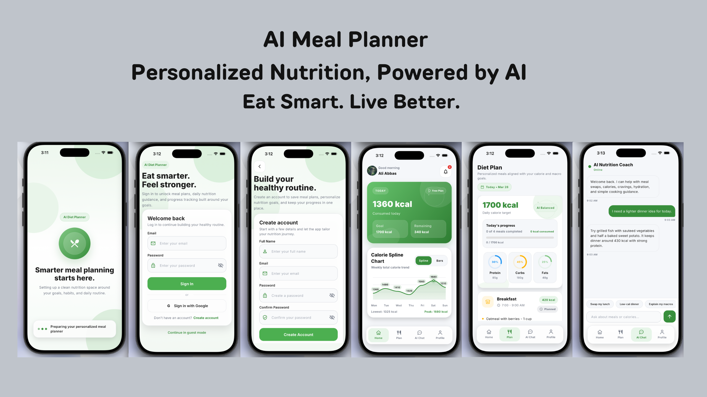
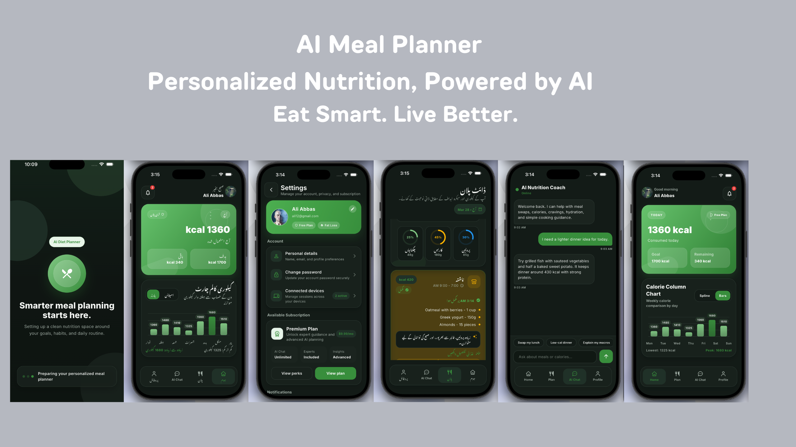

# 🍽️ AI Meal Planner

An AI-powered Flutter application that helps users plan meals, manage diet, and improve their health with smart recommendations.

---

## 📱 App Screenshots

<p align="center">
  
  
</p>

---

## 🚀 Features

* 🤖 AI-based personalized meal planning
* 🌍 Multi-language support (Localization)
* 🌙 Light & Dark theme support
* 📊 Health & nutrition tracking
* 🔄 Clean architecture using GetX
* ⚡ Fast and responsive UI

---

## 🛠️ Tech Stack

* **Flutter**
* **Dart**
* **GetX (State Management)**
* REST APIs
* GitHub Actions (CI/CD)

---

## 📦 CI/CD

This project uses **GitHub Actions** for:

* ✅ Running automated tests
* ✅ Building Android APK
* ✅ Creating GitHub Releases automatically

---

## ⚙️ Getting Started

### Prerequisites

* Flutter SDK installed
* Android Studio or VS Code

### Installation

```bash
git clone https://github.com/alee155/Ai_meal_planner.git
cd Ai_meal_planner
flutter pub get
flutter run
```

---

## 🧪 Run Tests

```bash
flutter test
```

---

## 📥 Download APK

You can download the latest APK from the **Releases** section of this repository.

---

## 📁 Project Structure

```
ai_meal_planner/
 ├── lib/
 ├── android/
 ├── ios/
 ├── screenshots/
 ├── test/
 ├── pubspec.yaml
 └── README.md
```

---

## 📚 Resources

* https://docs.flutter.dev/
* https://dart.dev/

---

## 👨‍💻 Author

Developed by **Ali Tahir**

---

## ⭐ Support

If you like this project, give it a ⭐ on GitHub!
